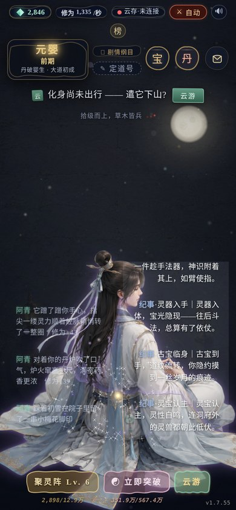
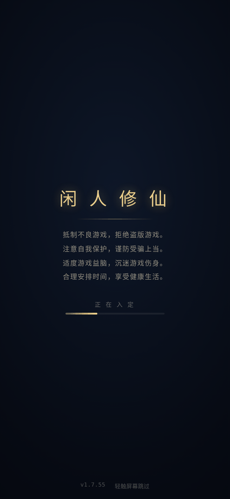

<div align="center">

# 闲人修仙 · Idle Xiuxian

**挂机放置修仙 · 水墨国风网页游戏**

纯前端 HTML5 · 浏览器打开即玩 · **离线也在涨修为** · 无需下载 · 免费开源


-lightgrey)

🔗 **在线试玩 → <https://xx.devgo.cn/>** （手机 / 电脑浏览器直接打开，无需安装）

 

<sub>← 主界面（左）· 开屏页（右）→</sub>

</div>

---

## 🎮 这是什么

一款 **挂机放置类修仙网页游戏**。主身闭关涨修为、下山斗法以战证道；化身云游替主身跑腿搜罗药草灵石——**全程挂机，关掉页面也在修行**，回来一次性结算离线收益。

纯前端单页应用（零依赖、无构建），外加一个轻量云存档服务：**换手机、换电脑，凭玩家码无缝续修**。

> 适合：喜欢**放置 / 挂机**玩法、**国风修仙**题材、**摸鱼时**想开个页面慢慢变强的人。

## ✨ 玩法特色

| | 特色 | 说明 |
| --- | --- | --- |
| 🕰 | **真·离线收益** | 关页照常修行：主身打坐、化身云游，归来结算，越挂越强 |
| 🖌 | **水墨墨线美学** | 纯 Canvas 2D 手绘「墨夜」背景（雾霭 / 星点 / 银河 / 纸月）+ 打坐修士立绘；不依赖 WebGL，低端机也顺 |
| 🧘 | **十二大境** | 凡人 → 炼气 → 筑基 → 结丹 → 元婴 → 化神 → 炼虚 → 合体 → 大乘 → 渡劫 → 真仙 → 天仙 |
| ⚔️ | **自动斗法** | 在线自动遇妖，逐合文字战斗（可速战），胜得灵石 / 修为 / 同级法宝 |
| 🐦 | **化身云游** | 遣化身下山跑腿，**关了页面它也在走**；药草、灵石、丹方残页雁足寄回 |
| 🍶 | **丹道全境** | 21 味材料、47 张丹方覆盖全部 12 境；未至之境不可见（防剧透），残页解锁隐藏古方 |
| 🏆 | **风云榜** | 全服 Top10 排行；道号全服唯一，改道号即绑定存档 |
| ☁️ | **云存档** | 玩家码即钥匙，多端同步；离线结算以服务器时间为权威 |
| 🦊 | **阿青打铁** | 守家灵狐自动炼宝、择优穿戴、旧宝熔回灵石，全程免手动 |

## 🕹 快速开始

**方式一：在线直接玩**

- <https://xx.devgo.cn/>

**方式二：本地跑（任意静态服务器即可）**

```bash
git clone https://github.com/xvguanglei1-oss/dongtian-idle-xiuxian.git
cd dongtian-idle-xiuxian
python3 -m http.server 8080
# 打开 http://localhost:8080
```

或直接用浏览器打开 `index.html`。

> 云存档需要配套的后端服务；本地跑不通云同步时，游戏会自动降级为纯本地存档，玩法不受影响。

## 🗂 项目结构

```
├── index.html      # 页面骨架 + 开屏页（健康游戏忠告）+ 内联主题
├── game.js         # 核心玩法：境界数值 / 剧情纪事 / 战斗 / 丹道 / 存档与云同步
├── bg.js           # 墨夜背景（纯 Canvas 2D：雾霭 / 视差星点 / 银河 / 纸月）
├── fx2d.js         # 灵气特效层（Canvas 2D 粒子 / 流光）
├── dt-theme.css    # 墨线主题样式（墨形按钮 / 卡片 / 品质辉光）
└── assets/
    ├── cultivator_*.png   # 打坐修士立绘（发 / 身 / 袍 三层呼吸）
    ├── main-bg.jpg        # 底图
    └── music/bgm.mp3      # 背景音乐
```

## 🧭 修行指引

- **修为靠挂机**：开着页面或离线都涨；聚灵阵提升产出，离线按云存档权威时间结算
- **渡劫要手动**：每大境圆满后需亲手渡劫才能进入下一卷（核心规则），成败看运气与根基
- **丹房**：材料来自云游与巡猎；材料齐了按钮会呼吸发光提醒，可一键开炉
- **云游**：化身出门后自行游历，收获以书信寄回；点开信匣收取才真正入账

## 🔍 关键词

`挂机修仙` `放置修仙` `摸鱼修仙` `文字修仙` `修仙网页游戏` `离线挂机` `挂机游戏` `放置游戏` `单机放置` `国风修仙` `水墨风游戏` `H5 网页游戏` `手机网页游戏` `免安装游戏` `免费开源游戏` `HTML5 游戏` `JavaScript 游戏` `Canvas 游戏`
`idle game` `incremental game` `idle rpg` `idle xianxia` `cultivation game` `chinese cultivation` `xianxia game` `browser idle game` `web game` `no download` `ink painting` `zen idle`

## 📜 免责声明

- 本游戏为**个人学习用途的同人 Demo**，世界观借鉴《凡人修仙传》，非商业项目。
- 角色立绘、背景等美术素材收集自公开网络资源，版权归原作者所有；仅用于技术演示，如涉及侵权请联系作者删除。
- 请勿将本 Demo 用于任何商业用途。

## 📄 License

代码部分 MIT；素材版权归各自原作者。
